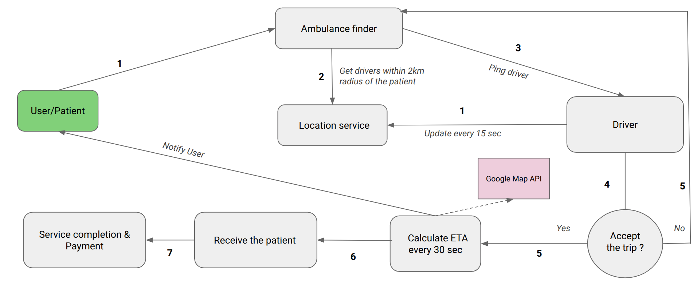
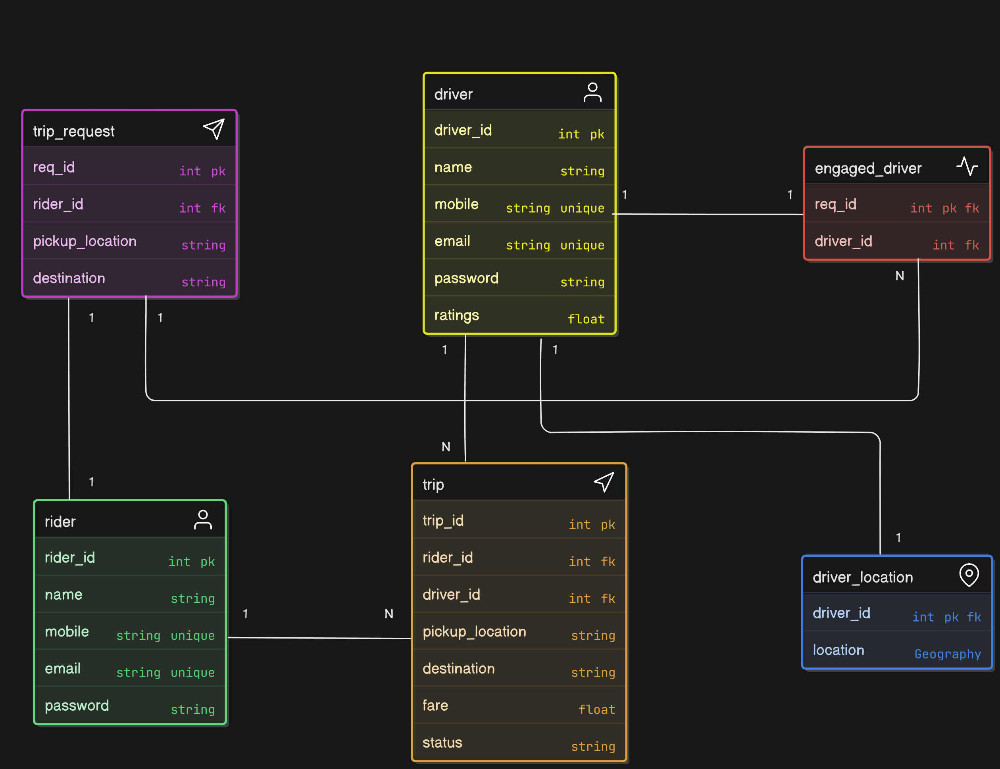

# snake-charmers

## Table of Contents
- [Team Members](#team-members)
- [Mentor](#mentor)
- [Project Description](#project-description)
- [Features](#features)
  - [For Users](#for-users)
  - [For Drivers](#for-drivers)
- [System Architecture](#system-architecture)
  - [Services Overview](#services-overview)
  - [System Flow Diagram](#system-flow-diagram)
- [ER Diagram](#er-diagram)
- [API Documentation](#api-documentation)
- [Technologies Used](#technologies-used)
- [Getting Started](#getting-started)
- [Development Guidelines](#development-guidelines)
- [Resources](#resources)

## Team Members
- [Imdad-Rakib](https://github.com/Imdad-Rakib) (Team Leader)
- [SA-K1B](https://github.com/SA-K1B)
- [iAmAreza](https://github.com/iAmAreza)

## Mentor
- [shakil-shahan](https://github.com/shakil-shahan)

## Project Description
LifeRide is a web-based platform designed to provide quick and efficient ambulance services by connecting users with nearby drivers. The system integrates with Google Maps API and notification services to ensure seamless service delivery.

## Features

### For Users
- Create a profile.
- View nearby ambulances.
- Add start and end locations.
- Show estimated time of arrival (ETA) and approximate price.
- Book an ambulance and make payments online.
- Rate drivers after service completion.

### For Drivers
- Create and manage profiles.
- Display availability status.
- Accept or reject ride requests.
- Start and end rides.
- Manage payments.

## System Architecture

### Services Overview
- **Location Service**: Manage driver locations.
- **Ambulance Finder Service**: Find nearby ambulances.
- **Auth Service**: User authentication and token validation.
- **Trip Service**: Manage trips.
- **WebSocket Service**: Facilitates client-server communication.

### System Flow Diagram

 

Below is an explanation of the system's operational flow:

1. **User Input**: 
   - The user sets the start and end locations.

2. **Ambulance Search**: 
   - The system uses the **Ambulance Finder Service** to identify drivers within a 2km radius of the user's location.

3. **Driver Ping**: 
   - Drivers are notified and can accept or reject the trip request.

4. **Trip Initiation**: 
   - If accepted, the system tracks the ambulance in real time using Google Maps API.

5. **Service Updates**:
   - Notifications are sent to the user about trip status (e.g., ETA, driver arrival).

6. **Completion and Payment**:
   - Once the trip is completed, payment is processed, and the user can rate the driver.

## ER Diagram
The Entity-Relationship (ER) diagram provides a visual representation of the database structure, showing the relationships between different entities.

## API Documentation

Detailed API documentation is available [here](https://app.swaggerhub.com/apis-docs/ImdadRaqib/api_documentation/1.0.0#/).

## Technologies Used
- **Backend**: WebSocket servers, REST APIs for core services.
- **Frontend**: User and driver interfaces.
- **API Integration**: Google Maps API for route and ETA calculation.
- **Database**: Stores user, driver, and trip details.
- **Load Balancer**: Ensures efficient routing for a smooth experience.

## Getting Started
1. Clone the repository
2. Install dependencies
3. Start development

## Development Guidelines
   This is a monorepo combining multiple microservice. Refer to the respective service folders to get the detailed development setup.

## Resources
- [Project Documentation](docs/)
- [Development Setup](docs/setup.md)
- [Contributing Guidelines](CONTRIBUTING.md)
